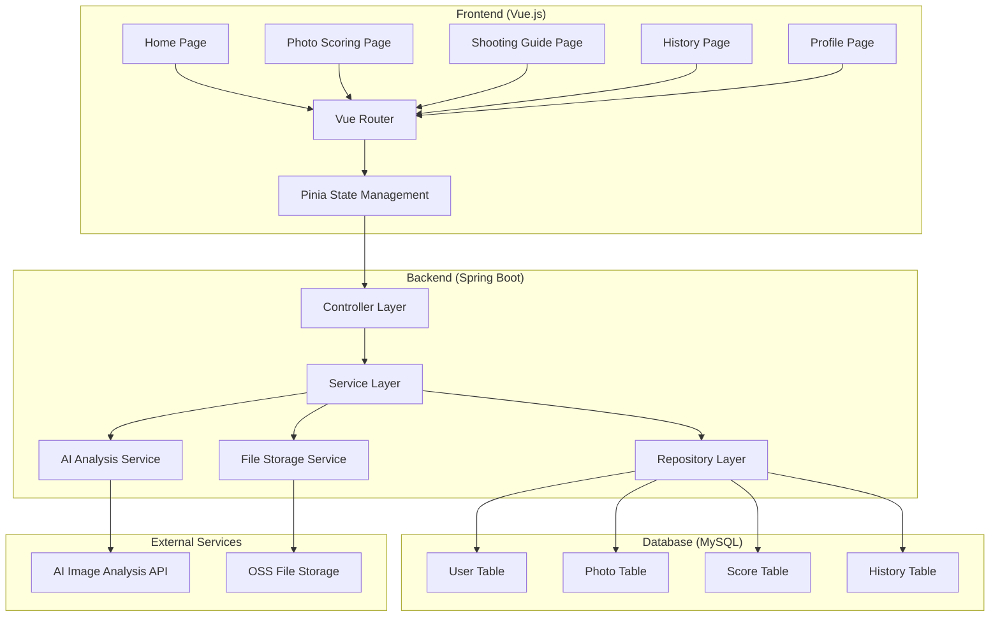
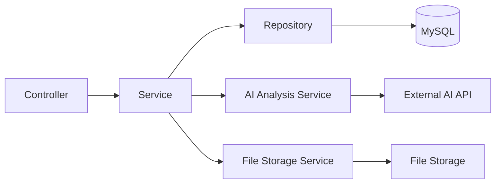
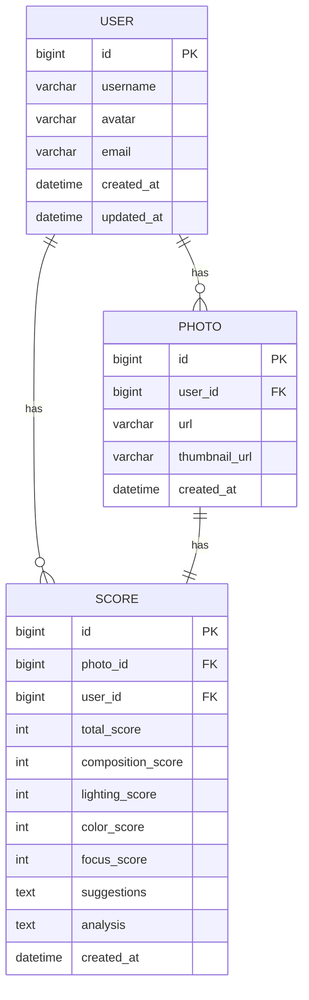

## 1. Architecture Design



## 2. Technology Description

- **Frontend**: Vue 3 + TypeScript + Vite + Tailwind CSS + Pinia + Vue Router
- **Backend**: Spring Boot 3.x + Java 17 + MyBatis Plus
- **Database**: MySQL 8.0
- **File Storage**: 本地存储或阿里云OSS
- **AI Service**: 预留接口，可集成多种AI图像分析服务

## 3. Route Definitions

| Route | Purpose |
|-------|---------|
| / | 首页 - 功能导航和快速上传 |
| /scoring | 照片评分页 - 上传照片并获取评分 |
| /guide | 拍摄指导页 - 实时取景和参数建议 |
| /history | 历史记录页 - 查看评分历史 |
| /profile | 个人中心页 - 用户信息和设置 |

## 4. API Definitions

### 4.1 Type Definitions

```typescript
// 用户信息
interface User {
  id: number;
  username: string;
  avatar?: string;
  createdAt: string;
}

// 照片信息
interface Photo {
  id: number;
  userId: number;
  url: string;
  thumbnailUrl: string;
  uploadTime: string;
}

// 评分结果
interface Score {
  id: number;
  photoId: number;
  totalScore: number;
  compositionScore: number;
  lightingScore: number;
  colorScore: number;
  focusScore: number;
  suggestions: string[];
  analysis: string;
  createdAt: string;
}

// 拍摄参数建议
interface ShootingAdvice {
  composition: string;
  exposure: string;
  focus: string;
  tips: string[];
}
```

### 4.2 API Endpoints

```typescript
// 上传照片
POST /api/photos/upload
Request: FormData (file: File)
Response: { id: number, url: string, thumbnailUrl: string }

// 获取评分
POST /api/scoring/analyze
Request: { photoId: number }
Response: Score

// 获取历史记录
GET /api/history?page=1&size=10
Response: { items: Score[], total: number }

// 删除历史记录
DELETE /api/history/:id
Response: { success: boolean }

// 获取拍摄建议
POST /api/guide/advice
Request: { imageData: string }
Response: ShootingAdvice

// 用户信息
GET /api/user/profile
Response: User

// 更新用户信息
PUT /api/user/profile
Request: { username?: string, avatar?: string }
Response: User
```

## 5. Server Architecture Diagram



### 5.1 Controller Layer
- PhotoController: 处理照片上传和管理
- ScoringController: 处理评分相关接口
- GuideController: 拍摄指导接口
- HistoryController: 历史记录管理
- UserController: 用户信息管理

### 5.2 Service Layer
- PhotoService: 照片业务逻辑
- ScoringService: 评分业务逻辑，调用AI分析
- GuideService: 拍摄指导业务逻辑
- HistoryService: 历史记录业务逻辑
- UserService: 用户业务逻辑
- FileStorageService: 文件存储服务
- AIAnalysisService: AI分析服务

## 6. Data Model

### 6.1 Data Model Definition



### 6.2 Data Definition Language

```sql
-- 用户表
CREATE TABLE user (
    id BIGINT PRIMARY KEY AUTO_INCREMENT,
    username VARCHAR(50) NOT NULL UNIQUE,
    avatar VARCHAR(255),
    email VARCHAR(100),
    created_at DATETIME DEFAULT CURRENT_TIMESTAMP,
    updated_at DATETIME DEFAULT CURRENT_TIMESTAMP ON UPDATE CURRENT_TIMESTAMP,
    INDEX idx_username (username)
) ENGINE=InnoDB DEFAULT CHARSET=utf8mb4;

-- 照片表
CREATE TABLE photo (
    id BIGINT PRIMARY KEY AUTO_INCREMENT,
    user_id BIGINT NOT NULL,
    url VARCHAR(255) NOT NULL,
    thumbnail_url VARCHAR(255),
    created_at DATETIME DEFAULT CURRENT_TIMESTAMP,
    INDEX idx_user_id (user_id),
    INDEX idx_created_at (created_at)
) ENGINE=InnoDB DEFAULT CHARSET=utf8mb4;

-- 评分表
CREATE TABLE score (
    id BIGINT PRIMARY KEY AUTO_INCREMENT,
    photo_id BIGINT NOT NULL,
    user_id BIGINT NOT NULL,
    total_score INT NOT NULL,
    composition_score INT NOT NULL,
    lighting_score INT NOT NULL,
    color_score INT NOT NULL,
    focus_score INT NOT NULL,
    suggestions TEXT,
    analysis TEXT,
    created_at DATETIME DEFAULT CURRENT_TIMESTAMP,
    INDEX idx_photo_id (photo_id),
    INDEX idx_user_id (user_id),
    INDEX idx_created_at (created_at)
) ENGINE=InnoDB DEFAULT CHARSET=utf8mb4;

-- 插入测试数据
INSERT INTO user (username, email) VALUES 
('demo_user', 'demo@example.com');
```

## 7. Project Structure

### 7.1 Frontend Structure
```
frontend/
├── src/
│   ├── components/
│   │   ├── PhotoUpload.vue
│   │   ├── ScoreDisplay.vue
│   │   ├── CameraView.vue
│   │   └── HistoryItem.vue
│   ├── pages/
│   │   ├── Home.vue
│   │   ├── PhotoScoring.vue
│   │   ├── ShootingGuide.vue
│   │   ├── History.vue
│   │   └── Profile.vue
│   ├── router/
│   │   └── index.ts
│   ├── stores/
│   │   ├── user.ts
│   │   └── photo.ts
│   ├── api/
│   │   └── index.ts
│   ├── utils/
│   │   └── request.ts
│   ├── App.vue
│   └── main.ts
├── public/
├── package.json
├── vite.config.ts
└── tsconfig.json
```

### 7.2 Backend Structure
```
backend/
├── src/
│   ├── main/
│   │   ├── java/
│   │   │   └── com/
│   │   │       └── photomentor/
│   │   │           ├── PhotoMentorApplication.java
│   │   │           ├── controller/
│   │   │           ├── service/
│   │   │           ├── mapper/
│   │   │           ├── entity/
│   │   │           ├── dto/
│   │   │           ├── config/
│   │   │           └── common/
│   │   └── resources/
│   │       ├── application.yml
│   │       └── mapper/
│   └── test/
├── pom.xml
└── README.md
```
