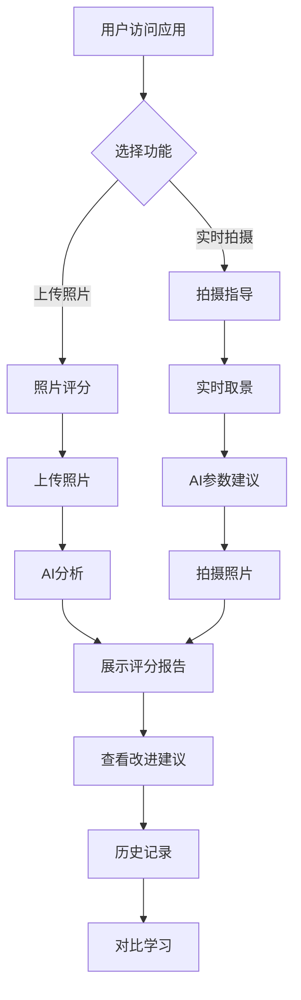

## 1. Product Overview

摄影专家评系统（PhotoMentor）是一款面向摄影小白的AI辅助摄影应用，提供智能图像评分、改进建议和实时拍摄指导，帮助用户快速提升摄影水平。

- 解决摄影小白尤其是男生给女朋友拍照时的痛点，提供专业的AI指导
- 通过AI技术让每一张照片都不再被嫌弃

## 2. Core Features

### 2.1 User Roles
| Role | Registration Method | Core Permissions |
|------|---------------------|------------------|
| Normal User | Email/手机号注册 | 上传照片、查看评分、获取建议、使用拍摄指导 |

### 2.2 Feature Module
1. **首页**: 功能导航、热门作品展示、快速上传入口
2. **照片评分页**: 照片上传、AI评分展示、详细分析报告
3. **拍摄指导页**: 实时取景、构图辅助、参数建议
4. **历史记录页**: 评分历史、对比查看、学习进度
5. **个人中心页**: 用户信息、偏好设置、帮助反馈

### 2.3 Page Details
| Page Name | Module Name | Feature description |
|-----------|-------------|---------------------|
| 首页 | Hero区域 | 突出产品价值主张，展示核心功能入口 |
| 首页 | 快速上传 | 拖拽或点击上传照片进行评分 |
| 首页 | 热门作品 | 展示高分作品示例和用户案例 |
| 照片评分页 | 上传模块 | 支持图片格式、大小限制、进度显示 |
| 照片评分页 | 评分展示 | 总分（0-100）、分项评分（构图、光线、色彩、焦点） |
| 照片评分页 | 分析报告 | AI生成的详细改进建议、标注问题区域 |
| 拍摄指导页 | 实时取景 | 相机预览、构图辅助线显示 |
| 拍摄指导页 | 参数建议 | 实时分析当前场景，给出最佳拍摄参数 |
| 历史记录页 | 列表展示 | 时间线展示评分历史，支持筛选排序 |
| 历史记录页 | 对比功能 | 前后照片对比，显示进步曲线 |
| 个人中心页 | 用户信息 | 头像、昵称、使用统计 |

## 3. Core Process

用户上传照片 → AI分析照片 → 生成评分和报告 → 展示结果 → 用户查看建议 → 应用改进

## 4. User Interface Design

### 4.1 Design Style
- **Primary Colors**: 柔和粉色 (#FF6B9D) + 优雅紫色 (#9B59B6)，符合目标用户群体
- **Secondary Colors**: 温暖米色 (#FFF5F5) + 深灰色 (#333333)
- **Button Style**: 圆角矩形，柔和阴影，悬停时有轻微放大效果
- **Font**: 主标题使用优雅的Playfair Display，正文使用清爽的Inter
- **Layout Style**: 卡片式设计，充足留白，移动端优先
- **Icon Style**: 线性图标，柔和色彩，带有动画效果

### 4.2 Page Design Overview
| Page Name | Module Name | UI Elements |
|-----------|-------------|-------------|
| 首页 | Hero区域 | 渐变背景，大标题，渐变色按钮，微妙的悬浮动画 |
| 照片评分页 | 评分展示 | 环形进度条展示总分，分项评分使用卡片式布局 |
| 拍摄指导页 | 实时取景 | 半透明取景框，网格线，实时提示文字 |
| 历史记录页 | 列表展示 | 时间线布局，卡片缩略图，评分徽章 |

### 4.3 Responsiveness
- 采用Mobile-first设计理念，优先保证移动端体验
- 自适应布局：320px（手机）→ 768px（平板）→ 1024px（桌面）
- 触摸优化：大点击区域，流畅的手势操作
- H5适配：微信浏览器、移动端Safari/Chrome优化

### 4.4 Design Principles
- **温暖友好**: 使用柔和的色彩和友好的文案，让用户感到轻松
- **直观易用**: 简化操作流程，减少学习成本
- **鼓励式反馈**: 提供积极的建议，避免打击用户信心
- **精致细节**: 微交互动画，精致的阴影和渐变效果
